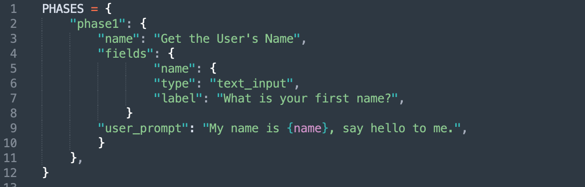
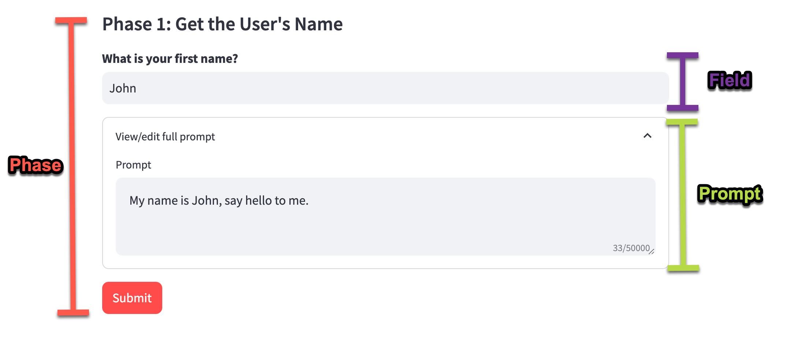
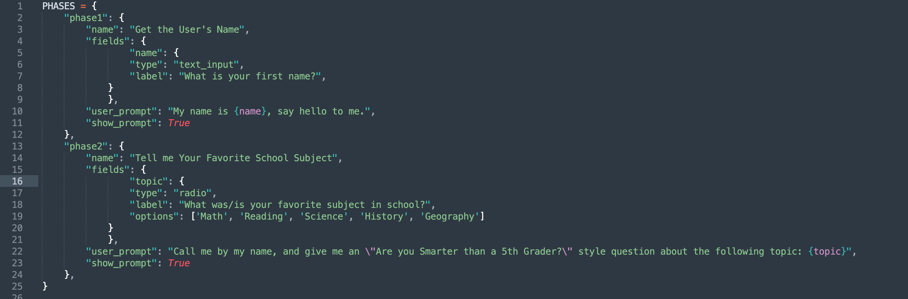
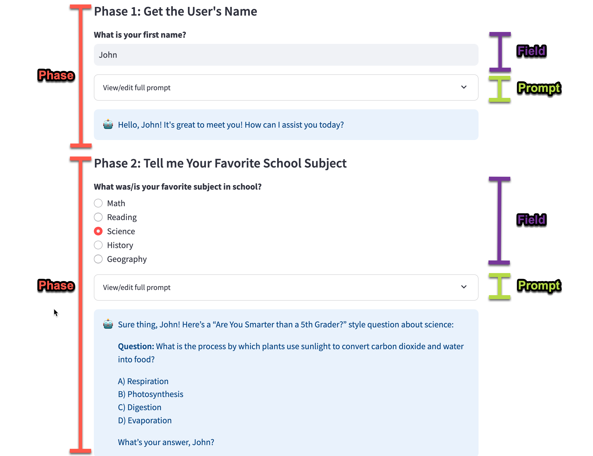
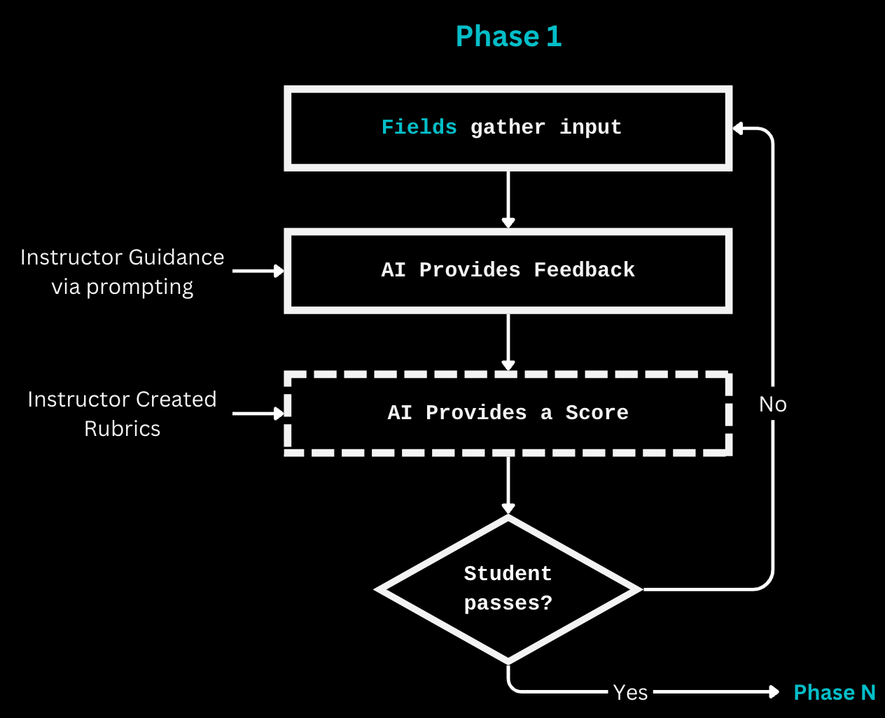

# Understanding Phases, Fields and Prompts

MicroApps are made up of **Phases, Fields, and Prompts**. 

A very simple app might have one Phase (_Get the User's Name_), one Field (_What is your Name?_), and one Prompt (_My name is {name}, say hello to me._)

This is what they looks like in a configuration file:



And this is what that app would look like: 



A slightly more complex app might have two phases, two fields, and two prompts. In this way, the app can gather a user's name and welcome them in Phase 1, and then gather information about their favorite subject to generate a fun question in the next phase. The configuration would look like this: 



And the app would look like this:



## Phases

Phases refer to distinct stages or steps in a process or workflow when interacting with an AI tool. These could involve different levels of processing, analysis, or interaction.

Typically, a phase ends with a submission to and response from AI. 

For information on various kinds of supported phases, see [Phases](reference_phases.md)

## Fields

Fields are inputs that the app requests from the user. 

Those inputs are typically used to construct the prompt to the AI.

For example, fields might include  distinct asks for inputs ie. "name," "level of education," and “subject area”  or an essay input from a student. 

For information on various kinds of supported fields, see [Fields](reference_fields.md)

## Prompts

Prompts are specific instructions or input given to an AI tool to generate a response or perform an action. A prompt is often a question, statement, or command that guides the AI's behavior.

Prompts include field data by enclosing the field name in curly brackets ```{}```

Prompts can also be conditional based on field inputs. For information on building prompts, including conditional prompts, see [TO-DO: Build this page][Reference: Prompts](reference_prompts.md)

## Scoring Phases

An important function of phases is to provide an opportunity to score a user's input to determine if they've met the requirements to move forward. For example, if you have built a critical thinking app for a case study, you'd want to make sure that the student can accurately describe what they case study is about before they move on to any kind of analysis of the study. 

You can learn more about phase scoring in the [Prompts](reference_prompts.md)


