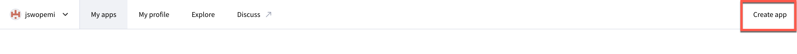
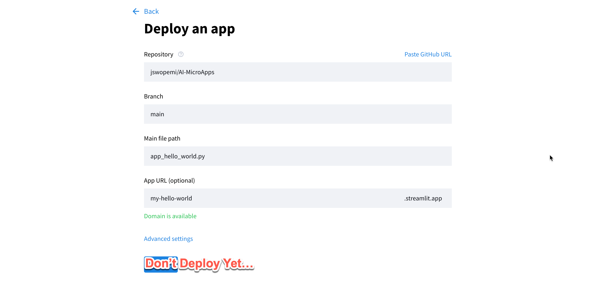
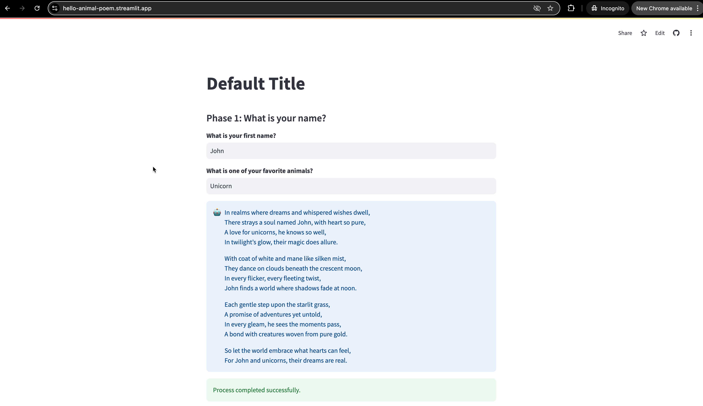

# Deploy to the Web

All apps are deployed via a free hosting service called Streamlit. 


## Deploy a Single App

1. Log into your <a href="https://streamlit.io" alt="Streamlit" target="_blank">Streamlit</a> account. 

2. Once logged in, click on "Create an app" in the top right corner.

	

3. Choose the option ```I have an app``` and select your forked GitHub repository.

4. Change the file path to the configuration file for the app you want to run. 

	e.g. ```app_hello_world.py```

	> **Note:** If you want to deploy more apps, simply use a different File Path and different App URL for each new app. 

5. Assign a memorable subdomain name for your MicroApp. 

	

6. In ```Advanced Settings```, add your AI API key(s).

	The format is:

		OPENAI_API_KEY="[My OpenAI Key]"
		GOOGLE_API_KEY="[My Google Gemini Key]"
		CLAUDE_API_KEY="[My Claude Key]"
		PERPLEXITY_API_KEY="[My Perplexity Key]"

	

	> **Note:** You can leave placeholders for any keys you don't have or don't want to use. You should at least add the OpenAI key, since the template defaults to OpenAI. 

7. Save your Advanced Settings, and click ```Deploy``` to deploy your app. 

8. Congratulations! You should have a working and shareable app at the URL that you specified. 

	


## Deploy an Apps Directory

Your Apps Directory is automatically generated from apps that have ```PUBLISHED = True``` and ```APP_URL="[some url]"``` in their respective configuration files. Therefore, when you launch your directory the first time, those settings will be the same as the original <a href="https://github.com/jswope00/AI-MicroApp-Template" alt="Build AI Microapp" target="_blank">MicroApp template repository</a>. It is recommended that you unpublish the old apps and republish apps to your directory after you deploy them to your own URLs. 

1. Repeat the steps above, but input the ```apps_directory.py``` for the Main File Path instead of the configuration file for a specific app. 

2. Congratulations! You should have a working Apps Directory at the URL that you specified. 

	


