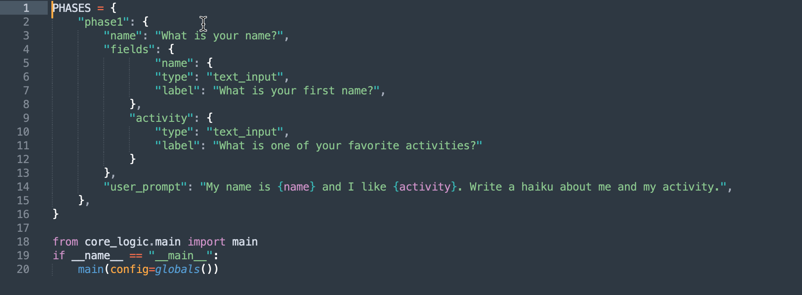
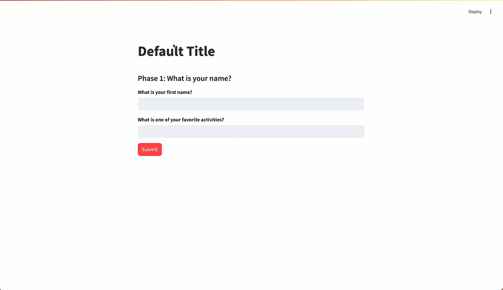

# AI MicroApps Guide

AI Microapps are the simplest free way to build AI-powered web apps that you can personalize and share.

Let's explain with an ✨AI-powered✨ Haiku App.

First, we configure about 10 lines to configure the app. In the image below, we are configuring two text fields to gather the users name and a favorite activity. The last line is the AI prompt that we'll send to AI with the user's input. It looks like this:

Here is the app we get:

## What Next

Once you've mastered the basics, you can start building customized apps for those long, complicated prompts that you always have trouble remembering exactly how you did them. And you can share your apps with others, allowing them to quickly and intuitively use an AI chain that you've developed.

AI Microapps was built by an educator for the education sector. It works well as either:

* **A course accelerator** - Build and share your customized Multiple Choice Question generators, Lesson Plan Builders, Alt Text Wizards and more.
* **Assessment & Feedback Tools** - You can create AI-powered exercises for your students like an AI Debate tool about this week's lesson, or a critical thinking practice app that is guided by your instruction.

AI MicroApps have nearly limitless customization capabilities and work with the most popular AI models, so you can make nearly any app and share it with anyone

Apps can be deployed to the web via Streamlit for free and nearly instantly.

Check out <a href="https://ai-microapps.streamlit.app/" target="_blank" alt="Gallery of AI Microapps">The Gallery</a> to be inspired and see the configuration for any app. Happy Building!