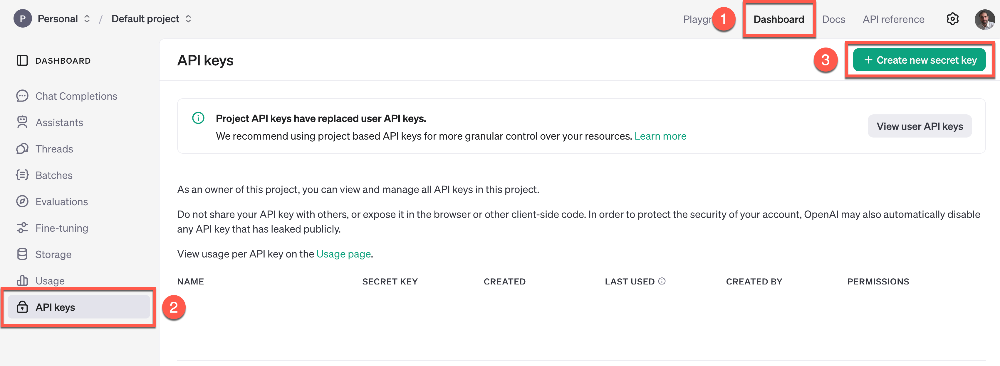
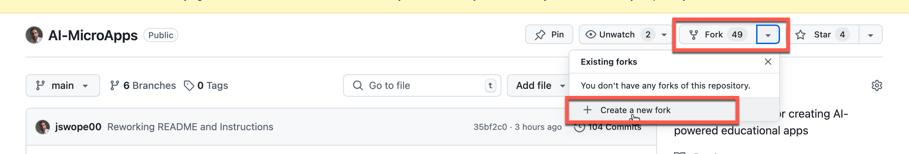
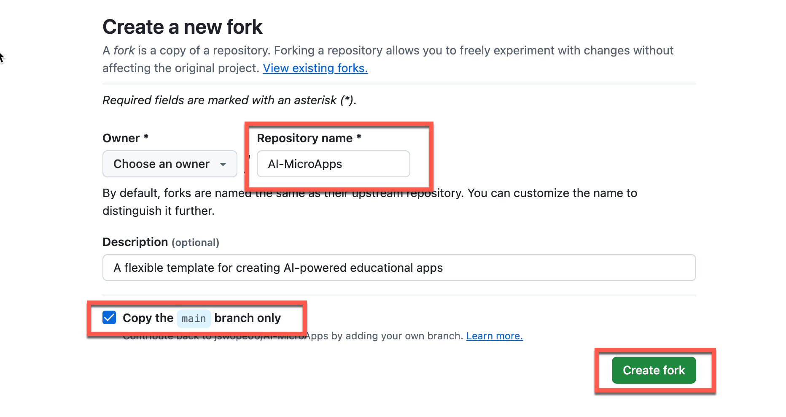
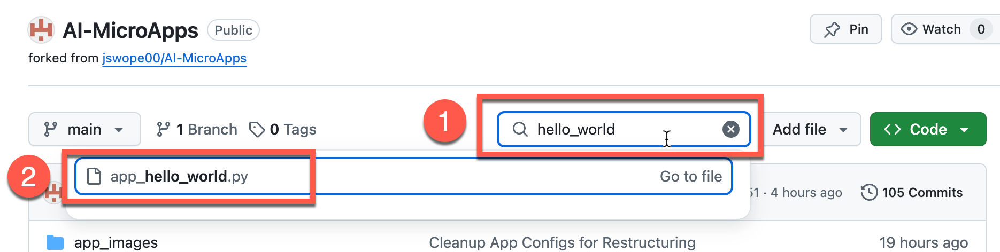
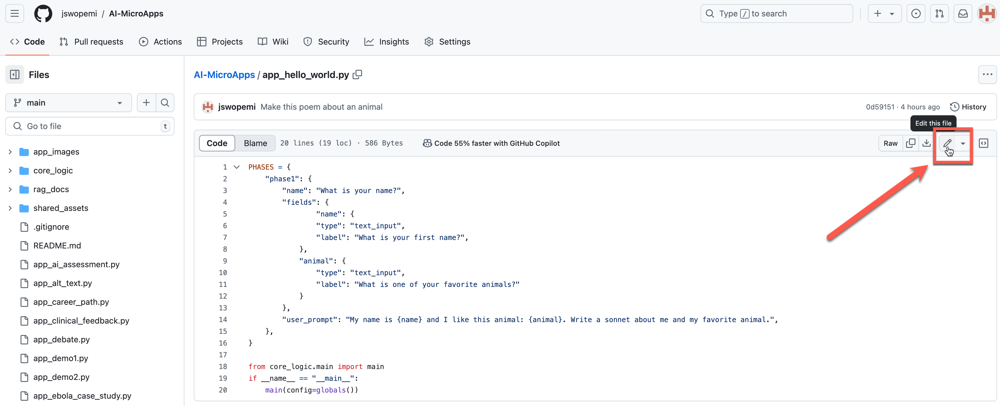
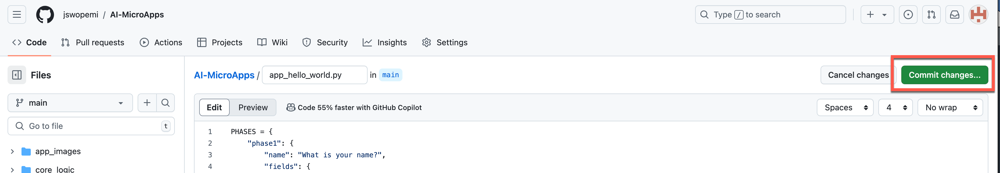
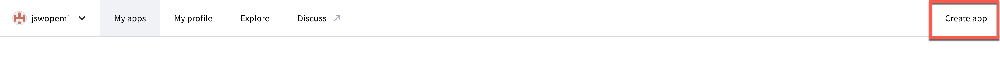
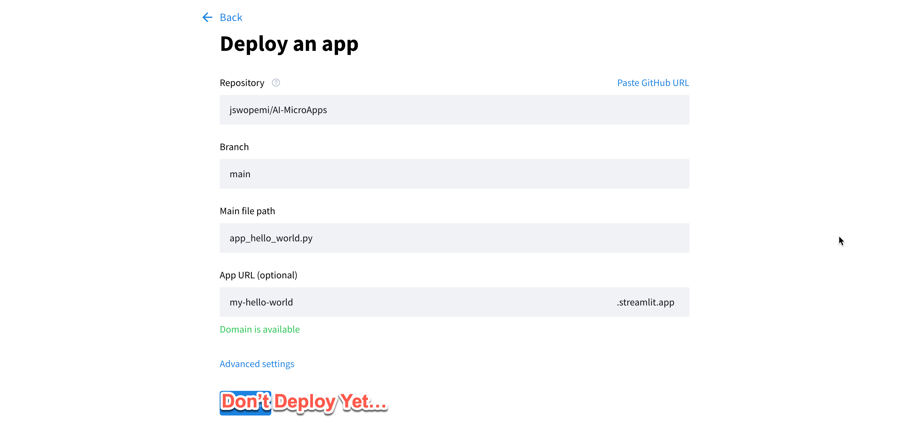
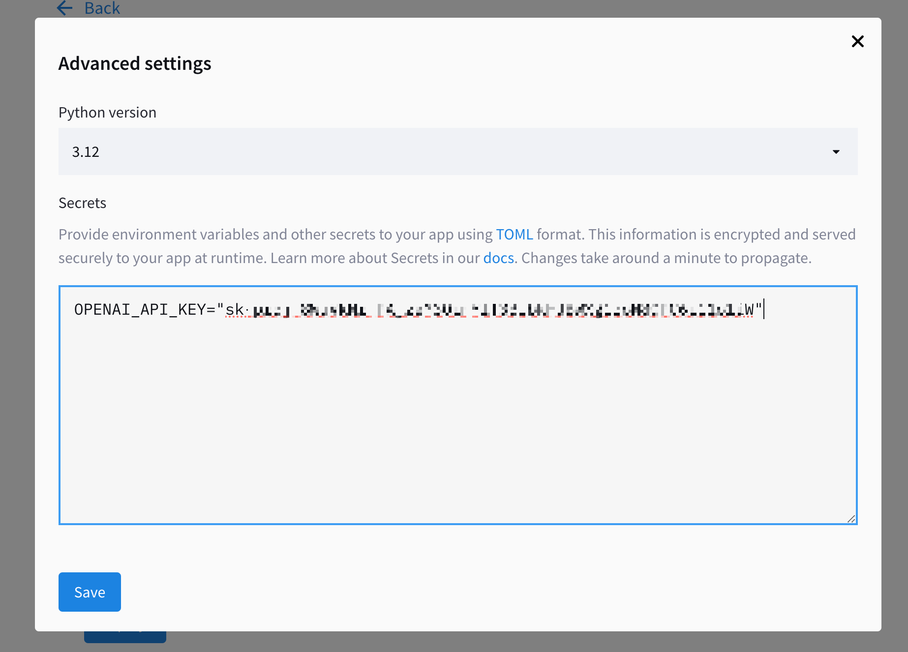
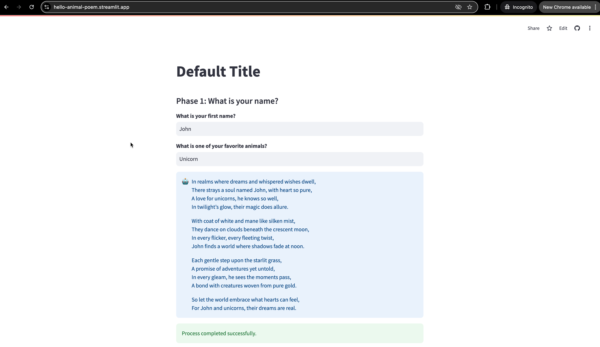

# AI MicroApps Quickstart

The easiest way to get an app up and running is to perform the whole process in Github and Streamlit, and it can be done in just a few minutes. 

<div style="position: relative; padding-bottom: 56.25%; height: 0; overflow: hidden; max-width: 100%; height: auto;">
    <iframe src="https://www.youtube.com/embed/VbaDqFhWmwM?si=SC3dLYfcS38CCKZh" title="YouTube video player" frameborder="0" allow="accelerometer; autoplay; clipboard-write; encrypted-media; gyroscope; picture-in-picture; web-share" referrerpolicy="strict-origin-when-cross-origin" allowfullscreen style="position: absolute; top: 0; left: 0; width: 100%; height: 100%;"></iframe>
</div>

## Pre-Requisites

1. Before you begin, ensure you have accounts at these two (free) services:

	* Github.com

	* Streamlit.io

2. Generate an API key with an AI service. For the quickstart, we'll use OpenAI. 

	* If you haven’t already, create an account at OpenAI. 

	* In the [OpenAI Dashboard](https://platform.openai.com/api-keys), go to the API section and create a new secret key. Save this key for later. 

			

	> **Note:** OpenAI changes the interface often, so it might look different from this screenshot 


## Fork the AI MicroApp Repository

1. Go to the <a href="https://github.com/jswope00/AI-MicroApp-Template" alt="Build AI Microapp" target="_blank">MicroApp template repository</a>

2. Click on the "Fork" button to create a copy of the repository in your own GitHub account.

	

3. Leave the default name for the repository and make sure to fork only the main branch.

	


## Customize an App in your Forked Repository

1. Go to your new GitHub repository.

2. Find and click on the ``app_hello_world.py`` file to bring up a view of the file. You can use the search bar if you like: 

	

3. Click on the pencil icon to edit the file.
	
	

4. Make some edits to the app configuration. If you want to use the edits from the quickstart video, you can replace all of the configuration in the file with the following lines: 

		```python
		PHASES = {
		    "phase1": {
		        "name": "What is your name?",
		        "fields": {
		                "name": {
		                "type": "text_input",
		                "label": "What is your first name?",
		            },
		            "animal": {
		            	"type": "text_input",
		            	"label": "What is one of your favorite animals?"
		            }
		        },
		        "user_prompt": "My name is {name} and I like this animal: {animal}. Write a sonnet about me and my favorite animal.",
		    },
		}

		from core_logic.main import main
		if __name__ == "__main__":
		    main(config=globals())
		```

5. Click "Commit changes" to save the updated file. You'll be asked to add a commit message and confirm your commit. 
	
	

## Deploy to the Web via Streamlit 

1. Log into your <a href="https://streamlit.io" alt="Streamlit" target="_blank">Streamlit</a> account. 

2. Once logged in, click on "Create an app" in the top right corner.

	

3. Choose the option ```I have an app``` and select your forked GitHub repository.

4. Change the file path to the configuration file for the app you want to run. 

	For the quickstart, this is ```app_hello_world.py```

5. Assign a memorable subdomain name for your MicroApp. 

	

6. In ```Advanced Settings```, add your OpenAI API key. For the quickstart, we'll just add the OpenAI key that we generated above. 

	The format is:

		OPENAI_API_KEY="[Your API Key]"

	

7. Save your Advanced Settings, and click ```Deploy``` to deploy your app. 

8. Congratulations! You should have a working and shareable app at the URL that you specified. 

	

If you feel confident with this quickstart, next try [deploying locally](build_local.md) so that you can use your own text/code editors and test on your local computer. 


