# Fields

These are the fields supported by MicroApps. They are a subset of fields that are supported by <a href="streamlit.io" target="_blank">Streamlit</a> and use much of the same syntax. 

[TOC]


## text_input

Display a single-line text input widget.

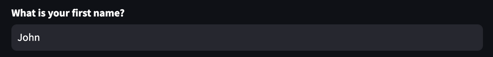


**Parameters**


<table>
  <tr>
   <td>type ("default" or "password")
   </td>
   <td>The type of the text input. This can be either "default" (for a regular text input), or "password" (for a text input that masks the user's typed value). Defaults to "default".
   </td>
  </tr>
  <tr>
   <td>label (str)
   </td>
   <td>A short label explaining to the user what this input is for. The label can optionally contain GitHub-flavored Markdown of the following types: Bold, Italics, Strikethroughs, Inline Code, and Links.
<p>
Unsupported Markdown elements are unwrapped so only their children (text contents) render. Display unsupported elements as literal characters by backslash-escaping them. E.g., "1\. Not an ordered list".
<p>
See the body parameter of st.markdown for additional, supported Markdown directives.
<p>
For accessibility reasons, you should never set an empty label (label="") but hide it with label_visibility if needed. In the future, we may disallow empty labels by raising an exception.
   </td>
  </tr>
  <tr>
   <td>value (object or None)
   </td>
   <td>The text value of this widget when it first renders. This will be cast to str internally. If None, will initialize empty and return None until the user provides input. Defaults to empty string.
   </td>
  </tr>
  <tr>
   <td>max_chars (int or None)
   </td>
   <td>Max number of characters allowed in text input.
   </td>
  </tr>
  <tr>
   <td>help (str)
   </td>
   <td>An optional tooltip that gets displayed next to the input.
   </td>
  </tr>
  <tr>
   <td>placeholder (str or None) 
<p>
[keyword only]
   </td>
   <td>An optional string displayed when the text input is empty. If None, no text is displayed.
   </td>
  </tr>
  <tr>
   <td>label_visibility ("visible", "hidden", or "collapsed")
<p>
[keyword only]
   </td>
   <td>The visibility of the label. If "hidden", the label doesn't show but there is still empty space for it above the widget (equivalent to label=""). If "collapsed", both the label and the space are removed. Default is "visible".
   </td>
  </tr>
</table>


## text_area

Display a multi-line text input widget.

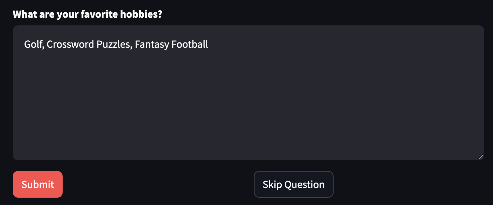

**Parameters**


<table>
  <tr>
   <td>label (str)
   </td>
   <td>A short label explaining to the user what this input is for. The label can optionally contain GitHub-flavored Markdown of the following types: Bold, Italics, Strikethroughs, Inline Code, and Links.
<p>
Unsupported Markdown elements are unwrapped so only their children (text contents) render. Display unsupported elements as literal characters by backslash-escaping them. E.g., "1\. Not an ordered list".
<p>
See the body parameter of st.markdown for additional, supported Markdown directives.
<p>
For accessibility reasons, you should never set an empty label (label="") but hide it with label_visibility if needed. In the future, we may disallow empty labels by raising an exception.
   </td>
  </tr>
  <tr>
   <td>value (object or None)
   </td>
   <td>The text value of this widget when it first renders. This will be cast to str internally. If None, will initialize empty and return None until the user provides input. Defaults to empty string.
   </td>
  </tr>
  <tr>
   <td>height (int or None)
   </td>
   <td>Desired height of the UI element expressed in pixels. If None, a default height is used.
   </td>
  </tr>
  <tr>
   <td>max_chars (int or None)
   </td>
   <td>Maximum number of characters allowed in text area.
   </td>
  </tr>
  <tr>
   <td>help (str)
   </td>
   <td>An optional tooltip that gets displayed next to the textarea.
   </td>
  </tr>
  <tr>
   <td>placeholder (str or None)
<p>
[keyword only]
   </td>
   <td>An optional string displayed when the text area is empty. If None, no text is displayed.
   </td>
  </tr>
  <tr>
   <td>label_visibility ("visible", "hidden", or "collapsed")
<p>
[keyword only]
   </td>
   <td>The visibility of the label. If "hidden", the label doesn't show but there is still empty space for it above the widget (equivalent to label=""). If "collapsed", both the label and the space are removed. Default is "visible".
   </td>
  </tr>
</table>


## warning

Display warning message.

<table>
  <tr>
   <td>body (str)
   </td>
   <td>The warning text to display.
   </td>
  </tr>
</table>


## button

Display a button widget.


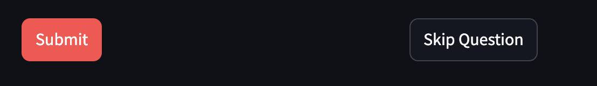


**Parameters:**


<table>
  <tr>
   <td>label (str)
   </td>
   <td>A short label explaining to the user what this button is for. The label can optionally contain GitHub-flavored Markdown of the following types: Bold, Italics, Strikethroughs, Inline Code, and Links.
<p>
Unsupported Markdown elements are unwrapped so only their children (text contents) render. Display unsupported elements as literal characters by backslash-escaping them. E.g., "1\. Not an ordered list".
<p>
See the body parameter of st.markdown for additional, supported Markdown directives.
   </td>
  </tr>
  <tr>
   <td>help (str)
   </td>
   <td>An optional tooltip that gets displayed when the button is hovered over.
   </td>
  </tr>
  <tr>
   <td>on_click (callable)
   </td>
   <td>An optional callback invoked when this button is clicked.
   </td>
  </tr>
  <tr>
   <td>type ("secondary" or "primary")
<p>
[keyword only]
   </td>
   <td>An optional string that specifies the button type. Can be "primary" for a button with additional emphasis or "secondary" for a normal button. Defaults to "secondary".
   </td>
  </tr>
</table>


## Radio

Display a radio button widget.


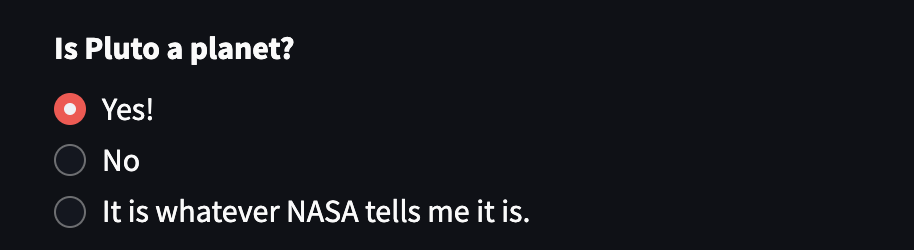

**Parameters:**


<table>
  <tr>
   <td>label (str)
   </td>
   <td>A short label explaining to the user what this radio group is for. The label can optionally contain GitHub-flavored Markdown of the following types: Bold, Italics, Strikethroughs, Inline Code, and Links.
<p>
Unsupported Markdown elements are unwrapped so only their children (text contents) render. Display unsupported elements as literal characters by backslash-escaping them. E.g., "1\. Not an ordered list".
<p>
See the body parameter of st.markdown for additional, supported Markdown directives.
<p>
For accessibility reasons, you should never set an empty label (label="") but hide it with label_visibility if needed. In the future, we may disallow empty labels by raising an exception.
   </td>
  </tr>
  <tr>
   <td>options (Iterable)
   </td>
   <td>Labels for the select options in an Iterable. This can be a list, set, or anything supported by st.dataframe. If options is dataframe-like, the first column will be used. Each label will be cast to str internally by default.
<p>
Labels can include markdown as described in the label parameter and will be cast to str internally by default.
   </td>
  </tr>
  <tr>
   <td>index (int or None)
   </td>
   <td>The index of the preselected option on first render. If None, will initialize empty and return None until the user selects an option. Defaults to 0 (the first option).
   </td>
  </tr>
  <tr>
   <td>help (str)
   </td>
   <td>An optional tooltip that gets displayed next to the radio.
   </td>
  </tr>
  <tr>
   <td>horizontal (bool)
<p>
[keyword only]
   </td>
   <td>An optional boolean, which orients the radio group horizontally. The default is false (vertical buttons).
   </td>
  </tr>
  <tr>
   <td>captions (iterable of str or None)
<p>
[keyword only]
   </td>
   <td>A list of captions to show below each radio button. If None (default), no captions are shown.
   </td>
  </tr>
  <tr>
   <td>label_visibility ("visible", "hidden", or "collapsed")
<p>
[keyword only]
   </td>
   <td>The visibility of the label. If "hidden", the label doesn't show but there is still empty space for it above the widget (equivalent to label=""). If "collapsed", both the label and the space are removed. Default is "visible".
   </td>
  </tr>
</table>


## markdown

Display string formatted as Markdown.


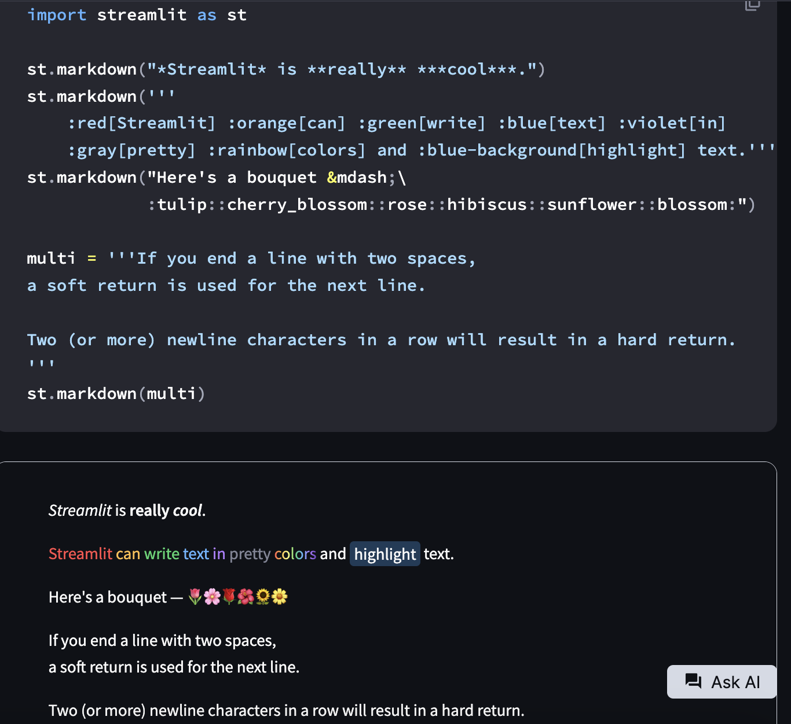

**Parameters:**


<table>
  <tr>
   <td>body (str)
   </td>
   <td>The string to display as GitHub-flavored Markdown. Syntax information can be found at: <a href="https://github.github.com/gfm">https://github.github.com/gfm</a> 
<p>
This also supports:
<ul>

<li>Emoji shortcodes, such as :+1: and :sunglasses:. For a list of all supported codes, see <a href="https://share.streamlit.io/streamlit/emoji-shortcodes">https://share.streamlit.io/streamlit/emoji-shortcodes</a>. 

<li>Google Material Symbols (rounded style), using the syntax :material/icon_name:, where "icon_name" is the name of the icon in snake case. For a complete list of icons, see Google's <a href="https://fonts.google.com/icons?icon.set=Material+Symbols&icon.style=Rounded">Material Symbols</a> font library.

<li>LaTeX expressions, by wrapping them in "$" or "$$" (the "$$" must be on their own lines). Supported LaTeX functions are listed at <a href="https://katex.org/docs/supported.html">https://katex.org/docs/supported.html</a>

<li>Colored text and background colors for text, using the syntax :color[text to be colored] and :color-background[text to be colored], respectively. color must be replaced with any of the following supported colors: blue, green, orange, red, violet, gray/grey, rainbow. For example, you can use :orange[your text here] or :blue-background[your text here].
</li>
</ul>
   </td>
  </tr>
  <tr>
   <td>unsafe_allow_html (bool)
   </td>
   <td>Whether to render HTML within body. If this is False (default), any HTML tags found in body will be escaped and therefore treated as raw text. If this is True, any HTML expressions within body will be rendered.
<p>
Adding custom HTML to your app impacts safety, styling, and maintainability.
<p>
Note: If you only want to insert HTML or CSS without Markdown text, we recommend using st.html instead.
   </td>
  </tr>
  <tr>
   <td>help (str)
<p>
[keyword only]
   </td>
   <td>An optional tooltip that gets displayed next to the Markdown.
   </td>
  </tr>
</table>


## selectbox

Display a select widget.

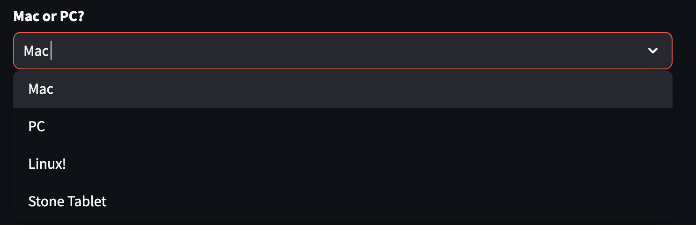

**Parameters:**


<table>
  <tr>
   <td>label (str)
   </td>
   <td>A short label explaining to the user what this select widget is for. The label can optionally contain GitHub-flavored Markdown of the following types: Bold, Italics, Strikethroughs, Inline Code, and Links.
<p>
Unsupported Markdown elements are unwrapped so only their children (text contents) render. Display unsupported elements as literal characters by backslash-escaping them. E.g., "1\. Not an ordered list".
<p>
See the body parameter of st.markdown for additional, supported Markdown directives.
<p>
For accessibility reasons, you should never set an empty label (label="") but hide it with label_visibility if needed. In the future, we may disallow empty labels by raising an exception.
   </td>
  </tr>
  <tr>
   <td>options (Iterable)
   </td>
   <td>Labels for the select options in an Iterable. This can be a list, set, or anything supported by st.dataframe. If options is dataframe-like, the first column will be used. Each label will be cast to str internally by default.
   </td>
  </tr>
  <tr>
   <td>index (int)
   </td>
   <td>The index of the preselected option on first render. If None, will initialize empty and return None until the user selects an option. Defaults to 0 (the first option).
   </td>
  </tr>
  <tr>
   <td>help (str)
   </td>
   <td>An optional tooltip that gets displayed next to the selectbox.
   </td>
  </tr>
  <tr>
   <td>placeholder (str)
<p>
[keyword only]
   </td>
   <td>A string to display when no options are selected. Defaults to "Choose an option".
   </td>
  </tr>
  <tr>
   <td>label_visibility ("visible", "hidden", or "collapsed")
<p>
[keyword only]
   </td>
   <td>The visibility of the label. If "hidden", the label doesn't show but there is still empty space for it above the widget (equivalent to label=""). If "collapsed", both the label and the space are removed. Default is "visible".
   </td>
  </tr>
</table>


## checkbox

Display a checkbox widget.


**Parameters:**


<table>
  <tr>
   <td>label (str)
   </td>
   <td>A short label explaining to the user what this checkbox is for. The label can optionally contain GitHub-flavored Markdown of the following types: Bold, Italics, Strikethroughs, Inline Code, and Links.
<p>
Unsupported Markdown elements are unwrapped so only their children (text contents) render. Display unsupported elements as literal characters by backslash-escaping them. E.g., "1\. Not an ordered list".
<p>
See the body parameter of st.markdown for additional, supported Markdown directives.
<p>
For accessibility reasons, you should never set an empty label (label="") but hide it with label_visibility if needed. In the future, we may disallow empty labels by raising an exception.
   </td>
  </tr>
  <tr>
   <td>value (bool)
   </td>
   <td>Preselect the checkbox when it first renders. This will be cast to bool internally.
   </td>
  </tr>
  <tr>
   <td>help (str)
   </td>
   <td>An optional tooltip that gets displayed next to the checkbox.
   </td>
  </tr>
  <tr>
   <td>label_visibility ("visible", "hidden", or "collapsed")
<p>
[keyword only]
   </td>
   <td>The visibility of the label. If "hidden", the label doesn't show but there is still empty space for it (equivalent to label=""). If "collapsed", both the label and the space are removed. Default is "visible".
   </td>
  </tr>
</table>


## Slider

Display a slider widget.

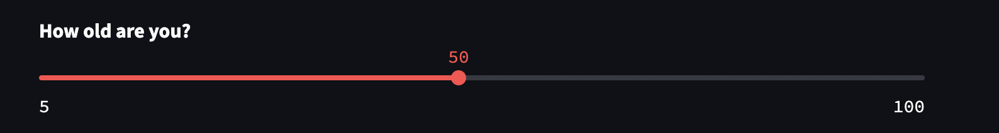


This supports int, float, date, time, and datetime types.

This also allows you to render a range slider by passing a two-element tuple or list as the value.

Note: Integer values exceeding +/- (1&lt;<53) - 1 cannot be accurately stored or returned by the widget due to serialization constraints between the Python server and JavaScript client. You must handle such numbers as floats, leading to a loss in precision.

**Parameters:**


<table>
  <tr>
   <td>label (str)
   </td>
   <td>A short label explaining to the user what this slider is for. The label can optionally contain GitHub-flavored Markdown of the following types: Bold, Italics, Strikethroughs, Inline Code, and Links.
<p>
Unsupported Markdown elements are unwrapped so only their children (text contents) render. Display unsupported elements as literal characters by backslash-escaping them. E.g., "1\. Not an ordered list".
<p>
See the body parameter of st.markdown for additional, supported Markdown directives.
<p>
For accessibility reasons, you should never set an empty label (label="") but hide it with label_visibility if needed. In the future, we may disallow empty labels by raising an exception.
   </td>
  </tr>
  <tr>
   <td>min_value (a supported type or None)
   </td>
   <td>The minimum permitted value. Defaults to 0 if the value is an int, 0.0 if a float, value - timedelta(days=14) if a date/datetime, time.min if a time.
   </td>
  </tr>
  <tr>
   <td>max_value (a supported type or None)
   </td>
   <td>The maximum permitted value. Defaults to 100 if the value is an int, 1.0 if a float, value + timedelta(days=14) if a date/datetime, time.max if a time.
   </td>
  </tr>
  <tr>
   <td>value (a supported type or a tuple/list of supported types or None)
   </td>
   <td>The value of the slider when it first renders. If a tuple/list of two values is passed here, then a range slider with those lower and upper bounds is rendered. For example, if set to (1, 10) the slider will have a selectable range between 1 and 10. Defaults to min_value.
   </td>
  </tr>
  <tr>
   <td>step (int, float, timedelta, or None)
   </td>
   <td>The stepping interval. Defaults to 1 if the value is an int, 0.01 if a float, timedelta(days=1) if a date/datetime, timedelta(minutes=15) if a time (or if max_value - min_value &lt; 1 day)
   </td>
  </tr>
  <tr>
   <td>help (str)
   </td>
   <td>An optional tooltip that gets displayed next to the slider.
   </td>
  </tr>
  <tr>
   <td>label_visibility ("visible", "hidden", or "collapsed")
   </td>
   <td>The visibility of the label. If "hidden", the label doesn't show but there is still empty space for it above the widget (equivalent to label=""). If "collapsed", both the label and the space are removed. Default is "visible".
   </td>
  </tr>
</table>


## number_input

Display a numeric input widget.

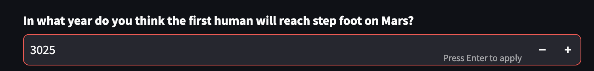


Note: Integer values exceeding +/- (1&lt;<53) - 1 cannot be accurately stored or returned by the widget due to serialization contstraints between the Python server and JavaScript client. You must handle such numbers as floats, leading to a loss in precision.

**Parameters:**


<table>
  <tr>
   <td>label (str)
   </td>
   <td>A short label explaining to the user what this input is for. The label can optionally contain GitHub-flavored Markdown of the following types: Bold, Italics, Strikethroughs, Inline Code, and Links.
<p>
Unsupported Markdown elements are unwrapped so only their children (text contents) render. Display unsupported elements as literal characters by backslash-escaping them. E.g., "1\. Not an ordered list".
<p>
See the body parameter of st.markdown for additional, supported Markdown directives.
<p>
For accessibility reasons, you should never set an empty label (label="") but hide it with label_visibility if needed. In the future, we may disallow empty labels by raising an exception.
   </td>
  </tr>
  <tr>
   <td>min_value (int, float, or None)
   </td>
   <td>The minimum permitted value. If None, there will be no minimum.
   </td>
  </tr>
  <tr>
   <td>max_value (int, float, or None)
   </td>
   <td>The maximum permitted value. If None, there will be no maximum.
   </td>
  </tr>
  <tr>
   <td>value (int, float, "min" or None)
   </td>
   <td>The value of this widget when it first renders. If None, will initialize empty and return None until the user provides input. If "min" (default), will initialize with min_value, or 0.0 if min_value is None.
   </td>
  </tr>
  <tr>
   <td>step (int, float, or None)
   </td>
   <td>The stepping interval. Defaults to 1 if the value is an int, 0.01 otherwise. If the value is not specified, the format parameter will be used.
   </td>
  </tr>
  <tr>
   <td>help (str)
   </td>
   <td>An optional tooltip that gets displayed next to the input.
   </td>
  </tr>
  <tr>
   <td>placeholder (str or None)
<p>
[keyword only]
   </td>
   <td>An optional string displayed when the number input is empty. If None, no placeholder is displayed.
   </td>
  </tr>
  <tr>
   <td>label_visibility ("visible", "hidden", or "collapsed")
<p>
[keyword only]
   </td>
   <td>The visibility of the label. If "hidden", the label doesn't show but there is still empty space for it above the widget (equivalent to label=""). If "collapsed", both the label and the space are removed. Default is "visible".
   </td>
  </tr>
</table>


## Image

Display an image with optional caption. 


**Parameters:**


<table>
  <tr>
   <td>image (numpy.ndarray, [numpy.ndarray], BytesIO, str, or [str])
   </td>
   <td>Monochrome image of shape (w,h) or (w,h,1) OR a color image of shape (w,h,3) OR an RGBA image of shape (w,h,4) OR a URL to fetch the image from OR a path of a local image file OR an SVG XML string like &lt;svg xmlns=...&lt;/svg> OR a list of one of the above, to display multiple images.
   </td>
  </tr>
  <tr>
   <td>caption (str or list of str)
   </td>
   <td>Image caption. If displaying multiple images, caption should be a list of captions (one for each image).
   </td>
  </tr>
</table>


## file_uploader

Display a file uploader widget.


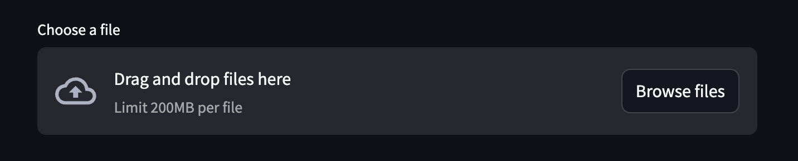


By default, uploaded files are limited to 200MB. You can configure this using the server.maxUploadSize config option. For more info on how to set config options, see [https://docs.streamlit.io/develop/api-reference/configuration/config.toml](https://docs.streamlit.io/develop/api-reference/configuration/config.toml) 

**Parameters:**


<table>
  <tr>
   <td>label (str)
   </td>
   <td>A short label explaining to the user what this file uploader is for. The label can optionally contain GitHub-flavored Markdown of the following types: Bold, Italics, Strikethroughs, Inline Code, and Links.
<p>
Unsupported Markdown elements are unwrapped so only their children (text contents) render. Display unsupported elements as literal characters by backslash-escaping them. E.g., "1\. Not an ordered list".
<p>
See the body parameter of st.markdown for additional, supported Markdown directives.
<p>
For accessibility reasons, you should never set an empty label (label="") but hide it with label_visibility if needed. In the future, we may disallow empty labels by raising an exception.
   </td>
  </tr>
  <tr>
   <td>type (str or list of str or None)
   </td>
   <td>Array of allowed extensions. ['png', 'jpg'] The default is None, which means all extensions are allowed.
   </td>
  </tr>
  <tr>
   <td>help (str)
   </td>
   <td>A tooltip that gets displayed next to the file uploader.
   </td>
  </tr>
  <tr>
   <td>label_visibility ("visible", "hidden", or "collapsed")
<p>
[keyword only]
   </td>
   <td>The visibility of the label. If "hidden", the label doesn't show but there is still empty space for it above the widget (equivalent to label=""). If "collapsed", both the label and the space are removed. Default is "visible".
   </td>
  </tr>
</table>


## Conditional Fields

Fields can be shown or hidden based on conditional logic.

Let's look at an example. Let's say we want to ask our user to choose their favorite character from a book, and _then_ ask them a question about that character. We only want to show the second question after they've answered the first. 

This is our configuration: 

      PHASES = {
          "phase1": {
              "name": "Tell me about a character in Canterbury Tales",
              "fields": {
                      "character": {
                         "type": "radio",
                         "label": "Choose your favorite character",
                         "options": ['The Knight', 'The Monk', 'The Pardoner']
                  },
                     "represent": {
                         "type": "text_area",
                         "label": "What does this character represent in the book?",
                         "showIf": {"character": {"$ne": ""}}
                  }
              },
              "show_prompt": True,
              "user_prompt": "My favorite character from Canterbury Tales is {character} and this is what they represent in the book: {represent}. Provide feedback on my analysis. "
          },
      }

And this is the rendered app before the user has met the conditional (answered the first question): 

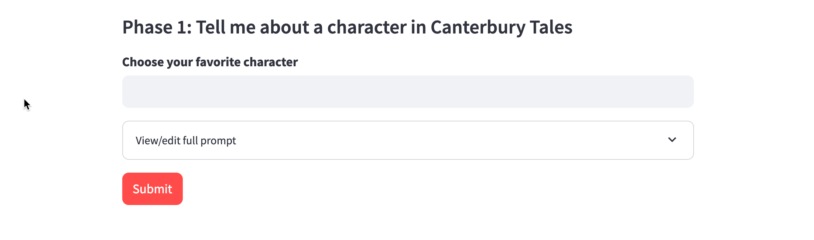

And here is the app again after the user has met the conditional (they answered the first question), so the second question appears.

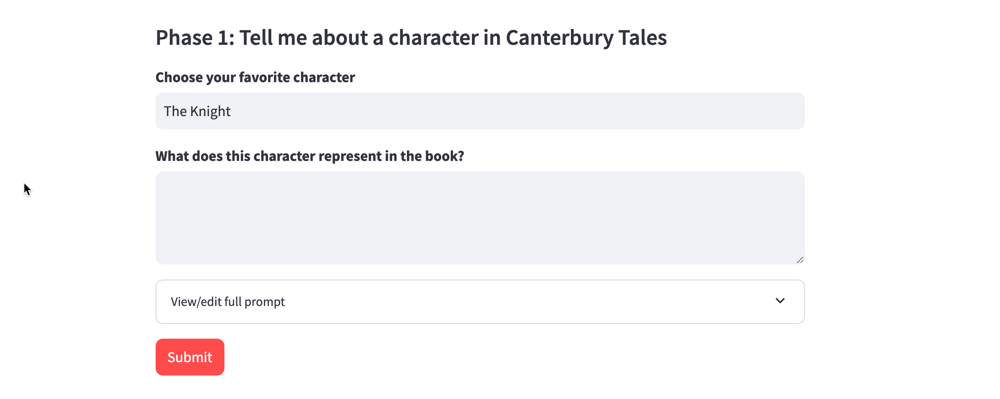

### Boolean Conditionals

Boolean values can be conditional based on whether they are True or False. If the condition is met, then the prompt snippet is included.  

Boolean conditionals can be: 

* True
* False

**Code Sample**

              "fields": {
                      "read": {
                         "type": "checkbox",
                         "label": "Have you read the book?",
                  },
                     "represent": {
                         "type": "text_area",
                         "label": "Provide a two paragraph summary of the book.",
                         "showIf": {"read": True}
                  }

### Numeric Conditionals

Numeric values can be conditional based on numbers that you choose. If the condition is met, then the prompt snippet is included.  

Numeric conditionals can be: 

* equal to 
* greater than (```$gt```)
* less than (```$lt```)
* greater than or equal to (```$gte```)
* less than or equal to (```$lte```)
* not equal to (```$ne```)


**Code Sample**

              "fields": {
                      "age": {
                         "type": "number_input",
                         "label": "What is your age?",
                  },
                     "license": {
                         "type": "checkbox",
                         "label": "Do you have a valid driver's license?",
                         "showIf": {"age": {"$gte": 16}}
                  }

### String Conditionals

String values can be conditional based on if they match a string that you choose. If the condition is met, then the prompt snippet is included.  

String conditionals can be: 

* equal to 
* not equal to (```$ne```)

**Code Sample**

              "fields": {
                      "education": {
                         "type": "radio",
                         "label": "What is your education level?",
                         "options": ['High School or Less','Some College Education']
                  },
                     "higher_education": {
                         "type": "radio",
                         "label": "What is your highest degree achieved?",
                         "options": ['None','Associates','Bachelor','Masters or PhD'],
                         "showIf": {"education": "Some College Education"}
                  }

### List Conditionals

Lists can be conditional based on whether they contain or do not contain certain values. If the condition is met, then the prompt snippet is included. 

* in (```$in```)
* not in (```$nin```)

**Code Sample**

> **Note:** AI MicroApps don't support any fields that return lists at the moment. Therefore, there are no code samples and this is a placeholder for when we do support list input fields. 

### Logic (and/or) Conditionals

Conditionals can be combined with and, or, and not

* and (```$and```)
* or (```$or```)

**Code Sample**

              "fields": {
                  "age": {
                     "type": "number_input",
                     "label": "What is your age?",
                  },
                  "license": {
                     "type": "checkbox",
                     "label": "Do you have a valid driver's license?",
                     "showIf": {"age": {"$gte": 16}}
                  },
                  "driver": {
                     "type": "radio",
                     "label": "Can you get a parent or guardian to drive you when you need it?",
                     "options": ['yes','no'],
                     "showIf": {
                        "$or": [
                           {"age": {"$lt": 16}},
                           {"license": False}
                        ]
                     }
                  }


