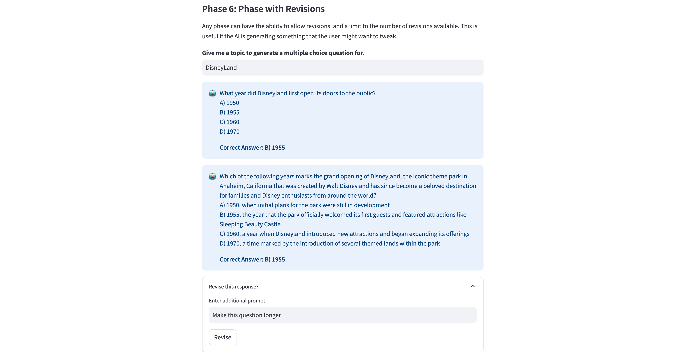
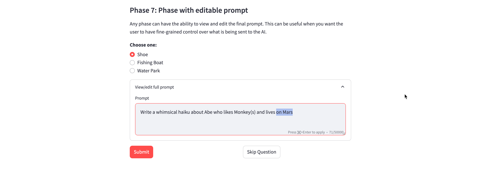
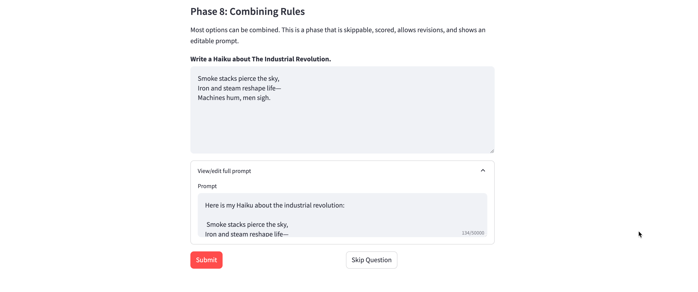

# Phases

These are the types of phases supported by MicroApps.

[TOC]


## Basic Feedback (Default)

The most basic phase asks a question, receives a response from the user, and sends that response in a prompt to the AI for feedback.


**Parameters**

n/a

**Code Sample**

    "phase2": {
        "name": "Basic Feedback",
        "fields": {
            "name": {
                "type": "text_input",
                "label": """What is your name?""",
                "value": "Abe"
            }
        },
        "user_prompt": "My name is {name}. Hello!",
    },


## No Submission

A phase can be purely informational and have no submission. It simply displays the fields and moves onto the next phase.


**Parameters**

| Parameter   | Type |
| -------- | ------- |
| no_submission  | bool    |

**Code Sample**

    "phase1": {
        "name": "No Submission",
        "fields": {
            "markdown": {
                "type": "markdown",
                "body": """A phase can be purely informational and have no submission. It simply displays the fields and moves onto the next phase.""",
                "unsafe_allow_html": True
            }
        },
        "no_submission": True
    },


## Skippable Phase

Phases can be skippable. Since an AI can make mistakes and get confused, it is recommended that phases are skippable whenever possible.


**Parameters**

| Parameter   | Type |
| -------- | ------- |
| allow_skip  | bool    |

**Code Sample**

    "phase3": {
        "name": "Skippable Phase",
        "fields": {
            "skip_me": {
                "type": "text_area",
                "label": "Write a 2,000 word analysis on The Epistemological Implications of Quantum Entanglement on Post-Structuralist Interpretations of Derrida’s Deconstructionism",
            }
        },
        "phase_instructions": "Analyze the user's essay on The Epistemological Implications of Quantum Entanglement on Post-Structuralist Interpretations of Derrida’s Deconstructionism",
        "user_prompt": "{skip_me}",
        "allow_skip": True,
    },


## Scored Phase

Phases can be scored according to a rubric. In general, AI provides more accurate scoring when instructions are specific and the criteria are measurable.


**Parameters**

| Parameter   | Type |
| -------- | ------- |
| scored_phase  | bool    |
| rubric | string |
| minimum_score | integer |

**Code Sample**

    "phase4": {
        "name": "Scored Phase",
        "fields": {
            "animal": {
                "type": "text_input",
                "label": "Provide the name of an animal. Any animal is fine, but it must be an animal.",
                "value": "Monkey"
            }
        },
        "phase_instructions": "The user will provide the name of an animal. Encourage them if they input a valid animal. Explain that they are incorrect if they do not.",
        "user_prompt": "{animal}",
        "allow_skip": True,
        "scored_phase": True,
        "rubric": """
                1. Animal Name
                    1 point - The user provides a valid animal name.
                    0 points - The user provides input that does not include a valid animal name. 
            """,
        "minimum_score": 1
    },


**Rubrics**

Rubrics are interpreted by AI, so they can typically be human readable. We have found rubrics with one or more dimensions where the score is clearly stated and the metrics are measureable to work well. Here is a sample rubric format:


      Dimension 1
         3 points - Your specific criteria for maximum points in this dimension
         2 points - Your criteria for 2 points in this dimension
         0 points - Your criteria for no points in this dimension
      Dimension 2
         5 points - Your specific criteria for maximum points in this dimension
         3 points - Your criteria for 3 points in this dimension
         1 points - Your criteria for 1 point in this dimension

## Hard-Coded Phase

You can provide hard-coded responses. For example, if you are just collecting some input and you want to provide static feedback for that input.


**Parameters**

| Parameter   | Type |
| -------- | ------- |
| ai_response | bool |
| custom_response  | string    |

> **Note:** You _can_ use user inputs in your hard-coded responses, by surrounding field names in the typical curly brackets ```{}```

**Code Sample**

    "phase5": {
        "name": "Hard-Coded Phase",
        "fields": {
            "name2": {
                "type": "text_input",
                "label": "What is another name?",
                "key": "name2",
                "value": "Abe"
            }
        },
        "allow_skip": True,
        "ai_response": False,
        "custom_response": "Hi {name2}! This is a hard-coded response, it is not being generated by AI."
    },

## Phase with Revisions

Any phase can have the ability to allow revisions, and a limit to the number of revisions available. This is useful if the AI is generating something that the user might want to tweak.



**Parameters**

| Parameter   | Type |
| -------- | ------- |
| allow_revisions | bool |
| max_revisions  | integer    |

**Code Sample**

    "phase6": {
        "name": "Phase with Revisions",
        "fields": {
            "topic": {
                "type": "text_input",
                "label": "Give me a topic to generate a multiple choice question for.",
                "value": "DisneyLand"
            }
        },
        "allow_skip": True,
        "ai_response": True,
        "user_prompt": "Please write me a single multiple choice question with three distractors and one correct answer about the following topic: {topic}",
        "allow_revisions": True,
        "max_revisions": 2,
    },

## Phase with Editable Prompt

Any phase can have the ability to view and edit the final prompt. This can be useful when you want the user to have fine-grained control over what is being sent to the AI.



**Parameters**

| Parameter   | Type |
| -------- | ------- |
| show_prompt  | bool    |
| read_only_prompt | bool |

**Code Sample**

    "phase7": {
        "name": "Phase with editable prompt",
        "fields": {
            "domicile": {
                "type": "radio",
                "label": "Choose one:",
                "options": ['Shoe', 'Fishing Boat', 'Water Park'],
            }
        },
        "allow_skip": True,
        "ai_response": True,
        "user_prompt": "Write a whimsical haiku about {name} who likes {animal}(s) and lives in a {domicile}",
        "show_prompt": True,
        "read_only_prompt": False
    },

## Phase Combining Several Rules

Most options can be combined. This is a phase that is skippable, scored, allows revisions, and shows an editable prompt.



**Code Sample**

    "phase8": {
        "name": "Combining Rules",
        "fields": {
            "haiku": {
                "type": "text_area",
                "height": 200,
                "label": "Write a Haiku about The Industrial Revolution.",
                "value": """Smoke stacks pierce the sky,
      Iron and steam reshape life—
      Machines hum, men sigh.""",
                  }
              },
              "allow_skip": True,
              "ai_response": True,
              "phase_instructions": "The user will write a Haiku about the industrial revolution. You should ensure it is a traditional Haiku and it is about the topic of the industrial revolution.",
              "user_prompt": "Here is my Haiku about the industrial revolution: \n\n {haiku}",
              "scored_phase": True,
              "rubric": """
              1. Haiku:
              2 points - The user has entered a true Haiku poem with traditional Haiku Structure.
              1 point - The user has entered a poem of some sort.
              0 points - The user has not entered a poem of any kind.
              2. Topic
              2 points - The user has mentioned the Industrial Revolution. 
              0 points - The user has NOT mentioned the Industrial Revolution. 
              """,
              "minimum_score": 2,
              "show_prompt": True,
              "read_only_prompt": False,
              "allow_revisions": True,
              "max_revisions": 2,
          }
