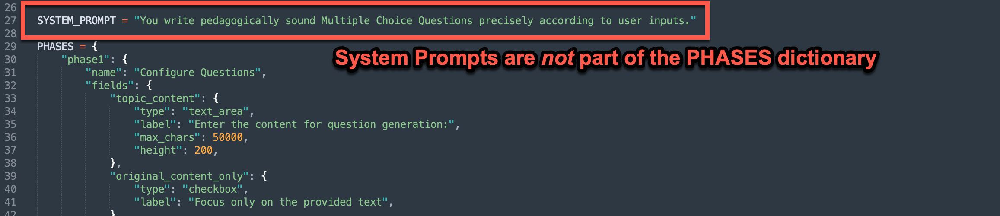
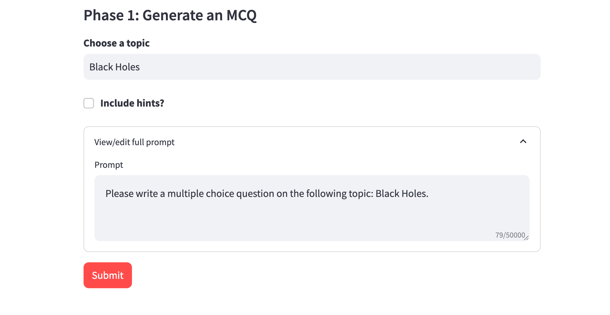
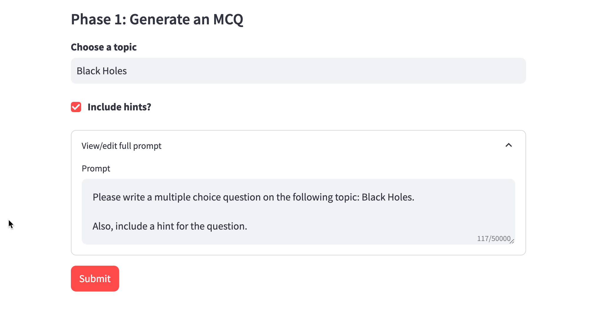

# Prompts

There are several ways to build prompts in AI Microapps. One of the things that makes MicroApps powerful is the ability to adapt prompts on the backend based on user inputs. 

[TOC]


## Basic Prompt

The most basic prompt is a standalone prompt to the AI. 

You can include user input by surrounding field names in curly brackets ```{}```

**Code Sample**


    "user_prompt": "My name is {name} and I like {activity}. Write a haiku about me and my activity.",


## System Prompt

A system prompt is context provided to the AI for every request. You can think about it "setting the tone" for how your AI responds. 

System Prompts are their own variable in the app configuration file. They are not part of the PHASES dictionary. 




**Code Sample**

      SYSTEM_PROMPT = "You write pedagogically sound Multiple Choice Questions precisely according to user inputs."


## Phase Instructions

Phase instructions are like phase-specific system prompts. They are extra instructions to the AI that are only provided for that phase. They are a way to provide additional instructions about what you want the AI to do in that step. 

**Code Sample**

      "phase_instructions": "The user will provide you their name. In one sentence only, welcome them by name and end your statement with 'Let's try a friendly debate in order to increase your understanding and fluency in the topic.'",

## Conditional Prompts

The ```user_prompt``` can be conditional, i.e. a prompt can depend on what the user input.

Let's look at a simple example. Let's say we want our user to indicate via checkbox whether they want to include hints for a generated multiple choice question. We only want to prompt the AI to include hints if the user asks for them. 

This is our configuration: 

      PHASES = {
          "phase1": {
              "name": "Generate an MCQ",
              "fields": {
                      "topic": {
                      "type": "text_input",
                      "label": "Choose a topic",
                  },
                  "hints": {
                      "type": "checkbox",
                      "label": "Include hints?",
                  }
              },
              "show_prompt": True,
              "user_prompt": [
                  {
                      "condition": {},
                      "prompt": "Please write a multiple choice question on the following topic: {topic}. \n\n",
                  },
                  {
                      "condition": {"hints": True},
                      "prompt": "Also, include a hint for the question."
                  },
              ]
          },
      }

And this is the rendered app when the user does not want hints: 



And here is the app again with the "hints" box checked. Note the change in the prompt. 



### Boolean Conditionals

Boolean values can be conditional based on whether they are True or False. If the condition is met, then the prompt snippet is included.  

Boolean conditionals can be: 

* True
* False

**Code Sample**

              "user_prompt": [
                  {
                      "condition": {},
                      "prompt": "Please write a multiple choice question on the following topic: {topic}. \n\n",
                  },
                  {
                      "condition": {"hints": True},
                      "prompt": "Also, include a hint for the question."
                  },
              ]

### Numeric Conditionals

Numeric values can be conditional based on numbers that you choose. If the condition is met, then the prompt snippet is included.  

Numeric conditionals can be: 

* equal to 
* greater than (```$gt```)
* less than (```$lt```)
* greater than or equal to (```$gte```)
* less than or equal to (```$lte```)
* not equal to (```$ne```)


**Code Sample**

              "user_prompt": [
                  {
                      "condition": {},
                      "prompt": "Provide age appropriate movie recommendations based on my age \n\n",
                  },
                  {
                      "condition": {"age": {"$gt": 16}},
                      "prompt": "I am older than 16 years old."
                  },
                  {
                      "condition": {"age": 16},
                      "prompt": "I am exactly 16 years old."
                  },
                  {
                      "condition": {"age": {"$lt": 16}},
                      "prompt": "I am younger than 16 years old."
                  },
              ]

### String Conditionals

String values can be conditional based on if they match a string that you choose, or if they are contained/not contained in a list of strings. If the condition is met, then the prompt snippet is included.  

String conditionals can be: 

* equal to 
* not equal to (```$ne```)
* in (```$in```)
* not in (```$nin```)

**Code Samples**

              "user_prompt": [
                  {
                     "condition": {},
                     "prompt": "I'd like to practice my {language}. I'll write a question in English and you answer the question. \n\n",
                  },            
                  {
                      "condition": {"language": "German"},
                      "prompt": "Please write your response in German \n\n"
                  },
                  {
                      "condition": {"language": {"$ne": "Spanish"},
                      "prompt": "Make sure not to write your answer in Spanish. \n\n"
                  },
               ]


              "user_prompt": [
                  {
                     "condition": {},
                     "prompt": "I am studying this language: {language}. Please quiz me. ",
                  },            
                  {
                      "condition": {"language": {"$in": ['French', 'Italian', 'Portuguese', 'Spanish', 'Romanian']}},
                      "prompt": "I am studying one of the romance languages! \n\n"
                  },
               ]

### Logic (and/or) Conditionals

Conditionals can be combined with and, or, and not

* and (```$and```)
* or (```$or```)

**Code Sample**

      {
          "condition": {"$and": [
              {"preferred_working_style": "Independent"},
              {"technical_or_non_technical": "Technical"},
              {"years_experience": {"$gt": 5}}
          ]},
          "prompt": "I prefer working independently and I am interested in a technical role. I am experienced in my field, and I am looking for a career that suits my skills and preferences."
      },


      {
          "condition": {"$or": [
              {"technical_or_non_technical": "Non-Technical"},
              {"years_experience": {"$lt": 5}}
          ]},
          "prompt": "I am likely better suited for either non-technical or junior roles."
      },

